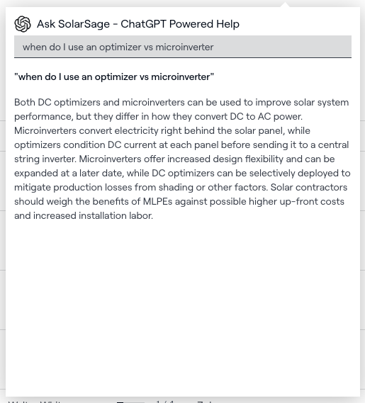
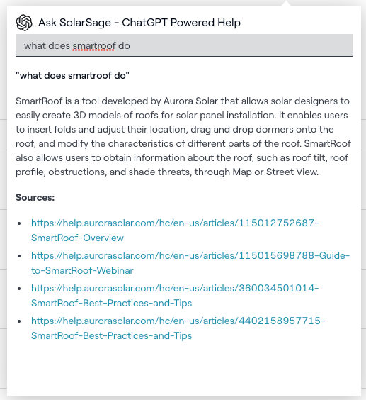

# 2023 Hackathon: ChatGPT for Aurora Solar Help

Populate Aurora Solar marketing and help website content as context for the ChatGPT engine. Based on the OpenAI tutorial https://platform.openai.com/docs/tutorials/web-qa-embeddings.

**Authors**: Adriel Luo and Eli Richmond

### Sample Questions

- how do I save money when designing solar panels
- How do you model a roof
- How do you model a barrier
- how do I use lidar for trees
- I want to create teams with different access. How do I do that?
- what does smartroof do
- when do I use an optimizer vs microinverter
- how does nem 3 impact customers
- is there an api to sync salesforce to aurora
- can i restrict what a user can do
- what is the difference between fire pathways and setbacks
- when do I need to add in a selective optimizer
- how much energy is produced given the irradiance
- how do I see the shadows cast on the roof\*

### Sample Responses:

